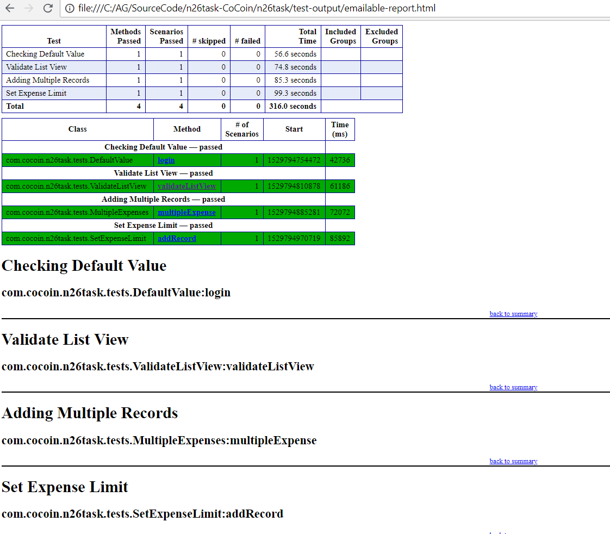

N26 – QE Home Challenge – Task2
===============================

### **Pre-Requisites / Requirements**:

Java (jdk 8.0_161)

Node JS (8.11.3)

GYNYMOTOIN – For virtual device (2.12.1)

Android SDK Tool

Appium (1.6.2)

Selenium server standalone (3.4)

Java Client jar file (4.1.2)

Log4j (1.2.17)

TestNG

Maven Framework

Eclipse – IDE (oxygen 2- 4.7.2)

Apache POI (3.17)

### **Virtual Device used:**

Android:ss Nexus 6

OS: 8.0

RAM: 1GB

Resolution: 1440x2560 – 560dpi

Base Memory: 3072 MB

Processor: 4

### **Test Case automated**

| Test ID: 1   | Test Name: Set Passcode and Login and validate default value for amount field  | Test Case Type: End-To-End                                      |
|--------------|--------------------------------------------------------------------------------|-----------------------------------------------------------------|
|              | Product: CoCoin                                                                | Priority: P0                                                    |
| **Step No.** | **Test Input**                                                                 | **Expected Result**                                             |
| 1.           | Launch CoCoin application                                                      | Application launched successfully                               |
| 2.           | Perform swipes 4 times on the initial screen to set the passcode               | Swipe performed successfully. Page to set the passcode shows up |
| 3.           | Enter the numeric passcode and confirm it by providing the same passcode again | Home page is loaded on successfully setting the passcode        |
| 4.           | Verify the default value present in the amount input field                     | Default value is set to sero                                    |
| Test ID: 1   | Test Name: Validate list view page                                             | Test Case Type: End-To-End                                      |
|              | Product: CoCoin                                                                | Priority: P0                                                    |
| **Step No.** | **Test Input**                                                                 | **Expected Result**                                             |
| 1.           | Launch CoCoin application                                                      | Application launched successfully                               |
| 2.           | Perform swipes 4 times on the initial screen to set the passcode               | Swipe performed successfully. Page to set the passcode shows up |
| 3.           | Enter the numeric passcode and confirm it by providing the same passcode again | Home page is loaded on successfully setting the passcode        |
| 4.           | Login to the app now without adding any expense                                | Logged in successfully                                          |
| 5.           | Navigate to list view page by selecting the top left option                    | List view page is displayed                                     |
| 6.           | Verify the record present in list view                                         | No record present as there is no record that was added          |
| 7.           | Navigate to set limit page by selecting the top left option                    | Set limit option is now available                               |
| 8.           | Set the upper and lower limit desired                                          | Verified the limit set was appropriate                          |
| Test ID: 1   | Test Name: Adding Multiple Expenses and validating the sum                     | Test Case Type: End-To-End                                      |
|              | Product: CoCoin                                                                | Priority: P0                                                    |
| **Step No.** | **Test Input**                                                                 | **Expected Result**                                             |
| 1.           | Launch CoCoin application                                                      | Application launched successfully                               |
| 2.           | Perform swipes 4 times on the initial screen to set the passcode               | Swipe performed successfully. Page to set the passcode shows up |
| 3.           | Set valid passcode                                                             | Passcode set successfully                                       |
| 4.           | Add 3 records from different category                                          | Records added successfully                                      |
| 5.           | Login to the app                                                               | Logged in successfully                                          |
| 6.           | Verify the amount that is shown in the home page                               | Sum of all expensed record is shown on the home page            |
| Test ID: 1   | Test Name: Validate list view page                                             | Test Case Type: End-To-End                                      |
|              | Product: CoCoin                                                                | Priority: P0                                                    |
| **Step No.** | **Test Input**                                                                 | **Expected Result**                                             |
| 1.           | Launch CoCoin application                                                      | Application launched successfully                               |
| 2.           | Perform swipes 4 times on the initial screen to set the passcode               | Swipe performed successfully. Page to set the passcode shows up |
| 3.           | Enter the numeric passcode and confirm it by providing the same passcode again | Home page is loaded on successfully setting the passcode        |
| 4.           | Login to the app now without adding any expense                                | Logged in successfully                                          |
| 5.           | Navigate to list view page by selecting the top left option                    | List view page is displayed                                     |
| 6.           | Verify the record present in list view                                         | No record present as there is no record that was added          |

### **A successful run testing report screen capture for reference as below:**

